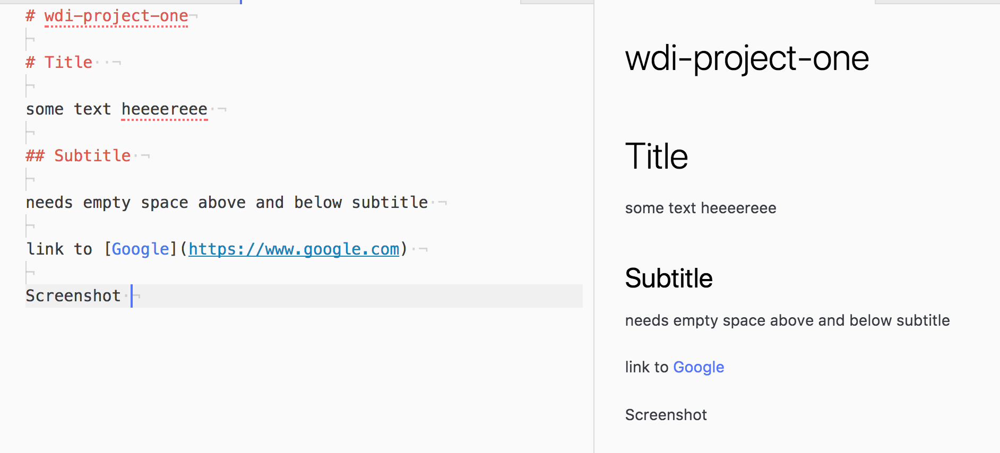

# wdi-project-one

# Title  

some text heeeereee

## Subtitle

needs empty space above and below subtitle

link to [Google](https://www.google.com)

# Screenshot

(terminal:)
mv ~/Desktop/Screen\ Shot\ 2018-10-18\ at\ 09.27.28.png .
(move Screenshot here)
mkdirs in kebab-case  

mv Screen\ Shot\ 2018-10-18\ at\ 09.27.28.png screenshots/example.png (move image to screenshot and rename to example.png)


([homepage] = alt tag)

# Bullets

* hello
* goodbye

- weirdly this works as well(!) ( - )


1. text
1. blah
1. afrihz;hg

(if doesn't work, add space above and below)

# Code Snippets

inline: `backticks and the code`

block: three sets of backticks at start and end (javascript) on the first line as backticks: will add colours etc.

``` javascript
function add(x, y) {
  return x + y
}
```
