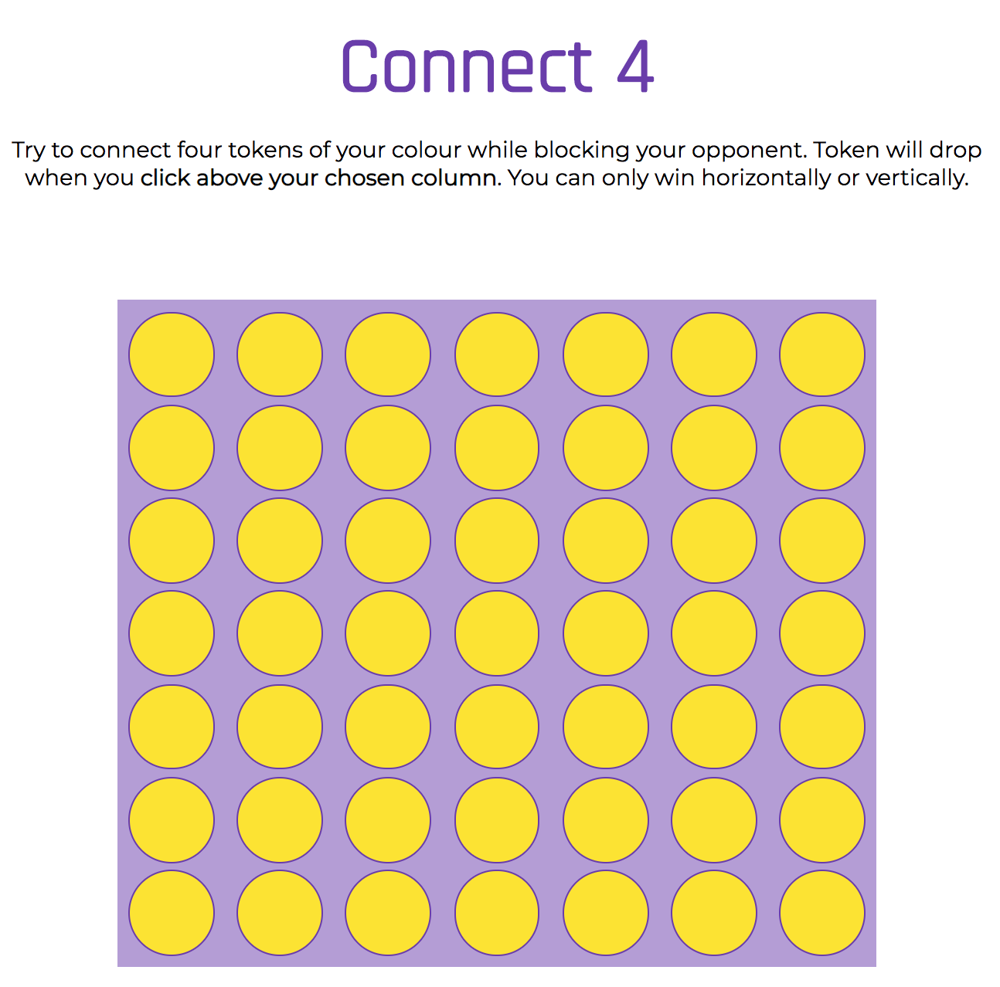

# Connect 4
## General Assembly's Web Development Immersive: Project 1

### Overview

### Brief
A two-player grid-based game rendered in the browser, made using HTML, CSS and JavaScript learnt in the first three weeks of the WDI course.  

### Technologies Used
- HTML
- CSS, with animation
- JavaScript
- Git and GitHub
- Google Fonts

### Wins and Blockers
- Creating the grid at the beginning proved to be quite a challenge.
- I'm happy with how the tokens behave on hover.

### Future Features
- Better styling.
- Adding some sounds with HTML5 audio tags for better user experience. 
- For now the players can't win diagonally, so I would like to add that functionality.
- I'd like to give the users the option for a few different token colours to choose from.
- Some subtle animation on the winning tokens at the end of the game would be lovely.
- Adding event listeners on the entire column, as opposed to the 'invisible' top row, to better guide the user.
