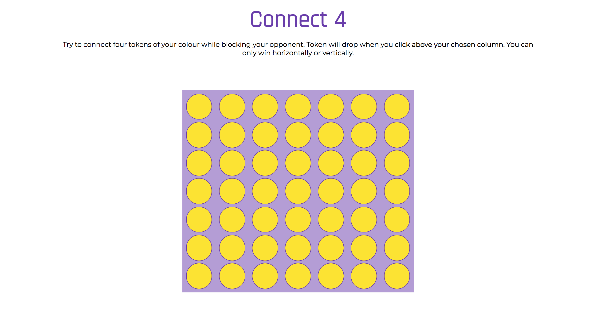
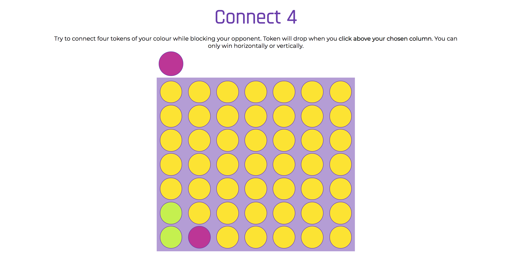
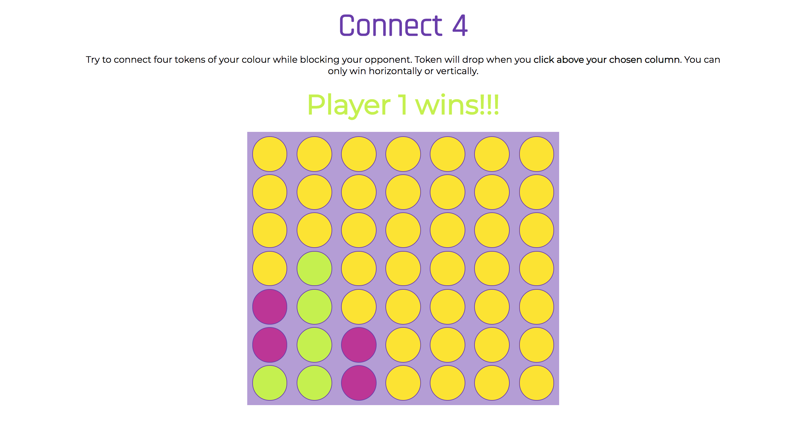

# Connect 4

#### General Assembly's Web Development Immersive: Project 1

A two-player grid-based game rendered in the browser, made using HTML, CSS and JavaScript learnt in the first three weeks of the WDI course.  
[Play the game online](https://terezakinnert.github.io/wdi-project-1/)

### Table of Contents

- [Description](#description)
  - [Brief](#brief)
  - [Tools and Technologies Used](#tools-and-technologies-used)
  - [Screenshots](#screenshots)
  - [Known Issues](#known-issues)
- [Challenges and Wins](#challenges-and-wins)
- [Future Work](#future-work)
- [Contact](#contact)

## Description

### Brief

The project's requirements were as follows:  

- [x] Render a game in the browser.
- [x] Switch turns between two players.
- [x] Design logic for winning & visually display which player won.
- [x] Include separate HTML / CSS / JavaScript files.
- [x] Use Javascript or jQuery for DOM manipulation.
- [x] Deploy your game online, using GitHub Pages.

### Tools and Technologies Used

- HTML5
- CSS3, including animation
- JavaScript
- Git and GitHub
- Google Fonts
- Asana

### Screenshots

Homepage

Game in progress

First player wins

### Known Issues

Users unfortunately can't win diagonally, yet. The game's complexity wasn't fully clear to me until I reached the win logic part of coding. I had to re-plan and only include horizontal and vertical wins to the new MVP.  

The user experience of the game could also be improved: instructions on a separate screen with a button to start the game, button to reset the game when it finishes, etc.

### Challenges and Wins

We started this project two and a half weeks into our coding bootcamp, after only a little over a week of learning JavaScript. To get to a functioning game after that is a win enough for me. There were a lot of challenging moments, but that's what the learning process is like 🤓.

### Future Work

If I had more time I would:

- Add event listeners on the entire column, as opposed to the 'invisible' top row, to better guide the user.
- Diagonal wins.
- Reset game button.
- Improve styling.
- Add sounds effects with HTML5 audio.
- Give users the option to choose from a few different token colours.
- Subtle animation on the winning tokens at the end of the game.

## Contact

Feel free to check out my [Portfolio](http://terezakinnert.com/) with more projects, or [LinkedIn profile](https://www.linkedin.com/in/terezakinnert/).
